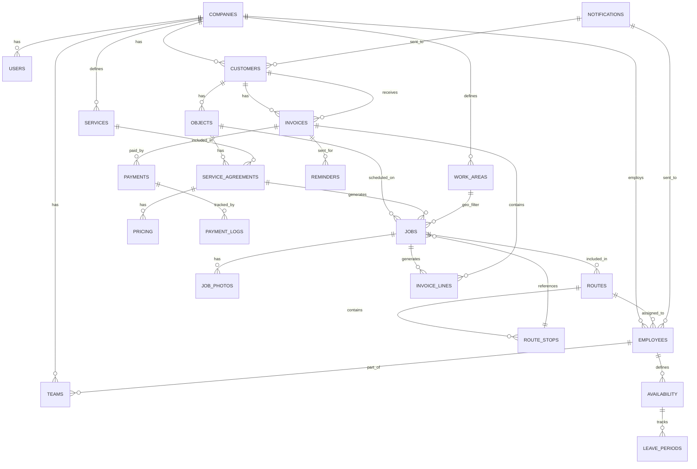

# 11 — Database Concept

**Status:** DONE
**Versie:** 1.4
**Bron van waarheid:** `00_PRD.md` § 12 (Technische Architectuur) — dit document mag het PRD niet tegenspreken.
**Werkinstructie:** zie `MASTER_PROMPT.md`.

---

## Doel van dit document

Dit document bevat het **logische en fysieke database-design** van ServOps:
- Architectuur-principes (PostgreSQL, RLS, PostGIS)
- Entity-Relationship Diagram (ERD)
- Tabel-overzicht met constraints
- Indexering & performance-strategie
- Soft-delete/archivering
- Migratie-aanpak

---

## 1. Architectuur-uitgangspunten

### PostgreSQL + Supabase

- **DBMS:** PostgreSQL 15+ (via Supabase)
- **Hosting:** Supabase (EU region, GDPR-compliant)
- **Extensions:** PostGIS (geodata), uuid-ossp (surrogate keys), pgcrypto (hashing)

### Multi-Tenancy via RLS (Row-Level Security)

**Principe:** Elke tabel bevat kolom `company_id` (Foreign Key → `companies` tabel). RLS-policies zorgen dat gebruiker NOOIT data van ander bedrijf ziet, ongeacht query.

**Implementatie:**
```sql
ALTER TABLE customers ENABLE ROW LEVEL SECURITY;

CREATE POLICY "Users see only own company's customers"
  ON customers FOR ALL
  USING (company_id = current_company_id());
```

**Benefit:** Database-level enforcement; geen bugs door query-filtering.

### UTC Timestamps

- Alle timestamps in kolommen `created_at`, `updated_at`, `completed_at` in **UTC**
- Uitmilieu: Europe/Amsterdam (PostgreSQL timezone settings)
- UI render via client-side timezone-conversion

### PostGIS Geodata

- Kolom `location` (geometry, SRID 4326 = WGS84): lat/lng van objecten
- Queries: geografische clustering via `ST_DWithin()`, etc.

---

## 2. Entity-Relationship Diagram (ERD)



---

## 3. Tabellenoverzicht met relaties

### 3.1 Tenant & User Management

#### `companies`
| Kolom | Type | Vereist | Uniek | Opmerkingen |
|---|---|---|---|---|
| `id` | UUID | ✓ | ✓ | PK |
| `name` | VARCHAR(255) | ✓ | ✗ | Bedrijfsnaam |
| `slug` | VARCHAR(100) | ✓ | ✓ | URL-friendly name |
| `created_at` | TIMESTAMP | ✓ | ✗ | UTC |
| `updated_at` | TIMESTAMP | ✓ | ✗ | UTC |
| `subscription_tier` | ENUM(starter,pro,enterprise) | ✓ | ✗ | Facturering |
| `max_employees` | INT | ✓ | ✗ | Soft-limit per tier |
| `config_json` | JSONB | ✓ | ✗ | Settings: BTW-default, verzend-voorkeur, herinner-dagen, etc. |
| `archived_at` | TIMESTAMP | ✗ | ✗ | Null = actief |

**Constraints:**
- PK: `id`
- UNIQUE: `slug`
- CHECK: `max_employees > 0`

---

#### `users`
| Kolom | Type | Vereist | Opmerkingen |
|---|---|---|---|
| `id` | UUID | ✓ | PK, Supabase Auth ID |
| `company_id` | UUID | ✓ | FK → `companies.id` |
| `email` | VARCHAR(255) | ✓ | Unique per company |
| `role` | ENUM(owner, admin, planner, administration, employee) | ✓ | Autorisatie — zie toelichting |
| `full_name` | VARCHAR(255) | ✓ | Display name |
| `created_at` | TIMESTAMP | ✓ | UTC |
| `updated_at` | TIMESTAMP | ✓ | UTC |
| `last_login_at` | TIMESTAMP | ✗ | Audit |
| `archived_at` | TIMESTAMP | ✗ | Soft-delete |

**Constraints:**
- PK: `id`
- FK: `company_id` → `companies`
- UNIQUE: (`company_id`, `email`)
- RLS: gebruiker ziet only own `company_id`

> **Toelichting `role`-enum (Sprint 1-fix 2026-07-08):** deze kolom stond hier eerder als `ENUM(owner, admin, planner, support)` — inconsistent met de canonieke rollenlijst in `23_Gebruikersrollen.md` § 1 (Eigenaar, Admin, Planner, **Administratie**, **Medewerker**), dat zichzelf expliciet aanwijst als "de functionele bron voor de RLS-policies". De oude enum miste `employee` (Medewerker) volledig en gebruikte `support` waar 23 een volwaardige `administratie`-rol met facturatie-CRUD beschrijft (geen "read-only"-rol). De enum is hier gecorrigeerd naar de vijf rollen uit 23 § 1: `owner` (Eigenaar), `admin` (Admin), `planner` (Planner), `administration` (Administratie), `employee` (Medewerker). `22_Authenticatie.md` § 7 noemde "Support: read-only + communication" waar 23 een Administratie-rol beschrijft mét facturatie-CRUD (geen read-only-rol); dat label is in dezelfde commit gecorrigeerd naar "Administratie".

---

### 3.2 Klanten & Objecten

#### `customers`
| Kolom | Type | Vereist | Opmerkingen |
|---|---|---|---|
| `id` | UUID | ✓ | PK |
| `company_id` | UUID | ✓ | FK, RLS |
| `name` | VARCHAR(255) | ✓ | Klant naam |
| `type` | ENUM(person, business) | ✓ | |
| `email` | VARCHAR(255) | ✗ | |
| `phone` | VARCHAR(20) | ✗ | |
| `whatsapp_number` | VARCHAR(20) | ✗ | |
| `whatsapp_opt_in` | BOOLEAN | ✓ | default FALSE |
| `email_opt_in` | BOOLEAN | ✓ | default TRUE |
| `billing_preference` | ENUM(email, whatsapp, post) | ✓ | default email |
| `kvk_number` | VARCHAR(8) | ✗ | Only if type=business |
| `vat_number` | VARCHAR(14) | ✗ | |
| `payment_terms_days` | INT | ✓ | default 14 |
| `notes` | TEXT | ✗ | |
| `created_at` | TIMESTAMP | ✓ | UTC |
| `updated_at` | TIMESTAMP | ✓ | UTC |
| `archived_at` | TIMESTAMP | ✗ | Soft-delete |

**Constraints:**
- PK: `id`
- FK: `company_id` → `companies`
- UNIQUE: (`company_id`, `email`) WHERE email IS NOT NULL
- RLS: `company_id = current_company_id()`

---

#### `objects` (Werklocatie)
| Kolom | Type | Vereist | Opmerkingen |
|---|---|---|---|
| `id` | UUID | ✓ | PK |
| `company_id` | UUID | ✓ | FK, RLS |
| `customer_id` | UUID | ✓ | FK → `customers` |
| `address_line1` | VARCHAR(255) | ✓ | Postcode + huisnummer |
| `address_line2` | VARCHAR(255) | ✗ | Apt/unit |
| `postal_code` | VARCHAR(10) | ✓ | NL: 4 cijfers + 2 letters, bijv. "1234 AB" (12_Entiteiten.md § 4) |
| `city` | VARCHAR(100) | ✓ | Plaats |
| `country_code` | VARCHAR(2) | ✓ | default NL |
| `location` | geometry(Point,4326) | ✗ (Sprint 2, zie PRD § 19 A-10) | PostGIS lat/lng; nullable zolang de Mapbox-geocoding-adapter nog niet gebouwd is |
| `location_status` | ENUM(geocoded, manual, failed) | ✓ | Geocoding status; default `manual` in Sprint 2 |
| `type` | ENUM(residence, commercial, complex, other) | ✓ | |
| `access_notes` | TEXT | ✗ | "3x bellen", etc. |
| `created_at` | TIMESTAMP | ✓ | UTC |
| `updated_at` | TIMESTAMP | ✓ | UTC |
| `archived_at` | TIMESTAMP | ✗ | Soft-delete |

**Constraints:**
- PK: `id`
- FK: `company_id`, `customer_id`
- UNIQUE: (`company_id`, `customer_id`, `postal_code`, `address_line1`)
- SPATIAL INDEX: `location` (GiST index voor PostGIS queries)
- RLS: `company_id = current_company_id()`

---

### 3.3 Diensten & Afspraken

#### `services`
| Kolom | Type | Vereist | Opmerkingen |
|---|---|---|---|
| `id` | UUID | ✓ | PK |
| `company_id` | UUID | ✓ | FK, RLS |
| `name` | VARCHAR(255) | ✓ | "Glasbewassing buiten" |
| `description` | TEXT | ✗ | |
| `standard_duration_minutes` | INT | ✓ | Geschatte duur |
| `standard_price_cents` | INT | ✓ | In centen (€5.50 = 550) |
| `vat_rate` | DECIMAL(5,2) | ✓ | 0, 9, 21 (als %) |
| `is_weather_sensitive` | BOOLEAN | ✓ | default FALSE |
| `weather_sensitivity_type` | ENUM(rain, frost, wind) | ✗ | If weather_sensitive |
| `icon` | VARCHAR(50) | ✗ | Emoji of icon-name |
| `color_hex` | VARCHAR(7) | ✗ | #RRGGBB |
| `archived_at` | TIMESTAMP | ✗ | Soft-delete |

---

#### `service_agreements`
| Kolom | Type | Vereist | Opmerkingen |
|---|---|---|---|
| `id` | UUID | ✓ | PK |
| `company_id` | UUID | ✓ | FK, RLS |
| `object_id` | UUID | ✓ | FK → `objects` |
| `service_id` | UUID | ✓ | FK → `services` |
| `frequency_type` | ENUM(weekly, biweekly, monthly, quarterly, yearly, once, custom) | ✓ | |
| `frequency_interval` | INT | ✗ | Days (if custom) |
| `pricing_id` | UUID | ✓ | FK → `pricings` |
| `preferred_day` | INT | ✗ | 0=Ma–6=Zo |
| `preferred_daypart` | ENUM(morning, afternoon) | ✗ | |
| `flexibility_window_days` | INT | ✓ | default 3 (±3 werkdagen) |
| `call_ahead_required` | BOOLEAN | ✓ | default FALSE |
| `exclude_dates` | DATE[] | ✗ | Feestdagen, etc. |
| `status` | ENUM(active, paused, ended) | ✓ | default active |
| `paused_until` | DATE | ✗ | If status=paused |
| `ended_at` | TIMESTAMP | ✗ | If status=ended |
| `last_completed_job_id` | UUID | ✗ | FK → `jobs` (optimization) |
| `next_ideal_date` | DATE | ✗ | Cached ideale datum volgende beurt |
| `created_at` | TIMESTAMP | ✓ | UTC |
| `updated_at` | TIMESTAMP | ✓ | UTC |

**Constraints:**
- PK: `id`
- FK: `company_id`, `object_id`, `service_id`, `pricing_id`
- UNIQUE: (`company_id`, `object_id`, `service_id`)

---

### 3.4 Beurten & Routes

#### `jobs`
| Kolom | Type | Vereist | Opmerkingen |
|---|---|---|---|
| `id` | UUID | ✓ | PK |
| `company_id` | UUID | ✓ | FK, RLS |
| `service_agreement_id` | UUID | ✓ | FK |
| `route_id` | UUID | ✗ | FK → `routes` (null als status=proposed) |
| `scheduled_date` | DATE | ✓ | Plannde datum |
| `status` | ENUM (proposed,planned,en_route,completed,invoiced,not_home,cancelled,rescheduling) | ✓ | BR-050 machine |
| `started_at` | TIMESTAMP | ✗ | Wanneer medewerker started |
| `completed_at` | TIMESTAMP | ✗ | Wanneer medewerker finished |
| `locked` | BOOLEAN | ✓ | default FALSE |
| `locked_until` | DATE | ✗ | Vergrendeld tot datum |
| `locked_reason` | VARCHAR(255) | ✗ | "Klant dinsdag 10:00 verwacht" |
| `notes` | TEXT | ✗ | |
| `estimated_duration_minutes` | INT | ✓ | |
| `actual_duration_minutes` | INT | ✗ | Berekend `completed_at - started_at` |
| `created_at` | TIMESTAMP | ✓ | UTC |
| `updated_at` | TIMESTAMP | ✓ | UTC |

**Constraints:**
- PK: `id`
- FK: `company_id`, `service_agreement_id`, `route_id`
- INDEX: (`company_id`, `scheduled_date`) voor planning-queries
- INDEX: (`company_id`, `status`) voor status-filtering

---

#### `routes`
| Kolom | Type | Vereist | Opmerkingen |
|---|---|---|---|
| `id` | UUID | ✓ | PK |
| `company_id` | UUID | ✓ | FK, RLS |
| `employee_id` | UUID | ✓ | FK → `employees` |
| `route_date` | DATE | ✓ | |
| `total_distance_meters` | INT | ✗ | |
| `total_drive_time_minutes` | INT | ✗ | |
| `total_work_time_minutes` | INT | ✗ | Som estimated_duration van jobs |
| `sequence_version` | INT | ✓ | default 0; increment bij re-optim |
| `optimization_score` | DECIMAL(5,2) | ✗ | 0–100 (reistijd/frequentie balance) |
| `created_at` | TIMESTAMP | ✓ | UTC |
| `updated_at` | TIMESTAMP | ✓ | UTC |

**Constraints:**
- PK: `id`
- FK: `company_id`, `employee_id`
- UNIQUE: (`company_id`, `employee_id`, `route_date`)

---

### 3.5 Medewerkers & Beschikbaarheid

#### `employees`
| Kolom | Type | Vereist | Opmerkingen |
|---|---|---|---|
| `id` | UUID | ✓ | PK |
| `company_id` | UUID | ✓ | FK, RLS |
| `user_id` | UUID | ✗ | FK → `users` (if app-user) |
| `first_name` | VARCHAR(100) | ✓ | |
| `last_name` | VARCHAR(100) | ✓ | |
| `phone` | VARCHAR(20) | ✓ | Contact |
| `is_active` | BOOLEAN | ✓ | default TRUE |
| `created_at` | TIMESTAMP | ✓ | UTC |
| `updated_at` | TIMESTAMP | ✓ | UTC |
| `archived_at` | TIMESTAMP | ✗ | Soft-delete |

---

#### `availability`
| Kolom | Type | Vereist | Opmerkingen |
|---|---|---|---|
| `id` | UUID | ✓ | PK |
| `company_id` | UUID | ✓ | FK |
| `employee_id` | UUID | ✓ | FK |
| `date` | DATE | ✓ | |
| `status` | ENUM(available, sick, leave) | ✓ | |
| `reason` | VARCHAR(255) | ✗ | "Griep", "Jaarlijks verlof" |
| `created_at` | TIMESTAMP | ✓ | UTC |

**Constraints:**
- PK: `id`
- UNIQUE: (`company_id`, `employee_id`, `date`)

---

### 3.6 Facturatie

#### `invoices`
| Kolom | Type | Vereist | Opmerkingen |
|---|---|---|---|
| `id` | UUID | ✓ | PK |
| `company_id` | UUID | ✓ | FK, RLS |
| `customer_id` | UUID | ✓ | FK |
| `invoice_number` | VARCHAR(50) | ✗ | Format: ABC-2026-00001 (null = draft) |
| `status` | ENUM(draft, finalized, sent, overdue, cancelled) | ✓ | default draft |
| `invoice_date` | DATE | ✓ | |
| `due_date` | DATE | ✓ | invoice_date + payment_terms_days |
| `total_amount_cents` | INT | ✓ | Incl. BTW |
| `total_tax_cents` | INT | ✓ | |
| `currency` | VARCHAR(3) | ✓ | EUR |
| `payment_status` | ENUM(open, paid, partial, overdue) | ✓ | default open |
| `payment_id` | VARCHAR(255) | ✗ | Mollie payment ID |
| `notes` | TEXT | ✗ | |
| `created_at` | TIMESTAMP | ✓ | UTC |
| `updated_at` | TIMESTAMP | ✓ | UTC |
| `sent_at` | TIMESTAMP | ✗ | Verzending-moment |
| `parent_invoice_id` | UUID | ✗ | FK → `invoices` (self); gezet op een creditfactuur, verwijst naar de gecorrigeerde factuur (FR-068, Sprint 9, `035_invoice_credit_notes.sql`). NULL voor een gewone factuur. |

**Constraints:**
- PK: `id`
- FK: `company_id`, `customer_id`, `parent_invoice_id` (self)
- UNIQUE: (`company_id`, `invoice_number`) WHERE invoice_number IS NOT NULL
- INDEX: (`company_id`, `status`, `due_date`); (`parent_invoice_id`) WHERE NOT NULL
- CHECK: `total_amount_cents`/`total_tax_cents` ≥ 0 wanneer `parent_invoice_id IS NULL`, ≤ 0 wanneer gezet (creditfactuur = negatief totaal, FR-068)

---

#### `invoice_lines`
| Kolom | Type | Vereist | Opmerkingen |
|---|---|---|---|
| `id` | UUID | ✓ | PK |
| `company_id` | UUID | ✓ | FK, RLS (gedenormaliseerd vanaf `invoices.company_id` t.b.v. directe RLS-enforcement en indexering — zie toelichting onder) |
| `invoice_id` | UUID | ✓ | FK |
| `job_id` | UUID | ✗ | FK → `jobs` (null = manual line) |
| `service_id` | UUID | ✗ | FK → `services` (for reference) |
| `description` | VARCHAR(255) | ✓ | "Glasbewassing (14/7/2026)" |
| `quantity` | DECIMAL(10,2) | ✓ | default 1.0 |
| `unit_price_cents` | INT | ✓ | Exclusief BTW |
| `vat_rate` | DECIMAL(5,2) | ✓ | 0, 9, 21 (%) |
| `vat_amount_cents` | INT | ✓ | Calculated |
| `total_amount_cents` | INT | ✓ | unit_price × qty + vat |
| `sequence` | INT | ✓ | Sorteer-volgorde |

**Constraints:**
- PK: `id`
- FK: `company_id`, `invoice_id`, `job_id`, `service_id`
- RLS: `company_id = current_company_id()`

---

#### `payments`
| Kolom | Type | Vereist | Opmerkingen |
|---|---|---|---|
| `id` | UUID | ✓ | PK |
| `company_id` | UUID | ✓ | FK, RLS (gedenormaliseerd vanaf `invoices.company_id`, zie toelichting onder) |
| `invoice_id` | UUID | ✓ | FK |
| `payment_method` | ENUM(ideal, sepa, manual) | ✓ | |
| `amount_cents` | INT | ✓ | |
| `payment_date` | DATE | ✓ | |
| `mollie_payment_id` | VARCHAR(255) | ✗ | Reference to Mollie |
| `status` | ENUM(pending, completed, failed, refunded) | ✓ | |
| `webhook_verified` | BOOLEAN | ✓ | Mollie-webhook received |
| `notes` | TEXT | ✗ | |
| `created_at` | TIMESTAMP | ✓ | UTC |

**Constraints:**
- PK: `id`
- FK: `company_id`, `invoice_id`
- RLS: `company_id = current_company_id()`

> **Toelichting RLS op `invoice_lines`/`payments` (PRR-fix 2026-07-08):** deze twee tabellen hadden oorspronkelijk geen `company_id` en geen gedocumenteerde RLS-policy — een gat t.o.v. NFR-301 ("100% via RLS op `company_id`; geen cross-tenant lek"), en juist op de gevoeligste (financiële) tabellen. Een RLS-policy die via een subquery op `invoices.company_id` loopt is functioneel mogelijk maar duurder en makkelijker te vergeten te testen; de gedenormaliseerde `company_id`-kolom (bij invoegen gekopieerd vanaf de bijbehorende `invoice`, nooit los muteerbaar) maakt de policy net zo direct en indexeerbaar als op elke andere tabel, en dwingt de negatieve RLS-test (31_Testplan.md § 4) op dezelfde manier af.

---

#### `invoice_number_counters` (concurrency-veilige factuurnummering — BR-020)
| Kolom | Type | Vereist | Opmerkingen |
|---|---|---|---|
| `company_id` | UUID | ✓ | FK, RLS; PK-deel |
| `year` | INT | ✓ | PK-deel |
| `last_seq` | INT | ✓ | default 0; opgehoogd binnen dezelfde transactie als de factuurfinalisering |
| `updated_at` | TIMESTAMP | ✓ | UTC |

**Constraints:**
- PK: (`company_id`, `year`)
- RLS: `company_id = current_company_id()`
- Toegang: uitsluitend via `invoice-finalize` (Edge Function, service-rol) met `SELECT ... FOR UPDATE` op de rij (10_BusinessRules.md § 5, BR-020) — nooit rechtstreeks via de data-API.

---

### 3.7 Communicatie

#### `notifications`
| Kolom | Type | Vereist | Opmerkingen |
|---|---|---|---|
| `id` | UUID | ✓ | PK |
| `company_id` | UUID | ✓ | FK, RLS |
| `recipient_type` | ENUM(customer, employee) | ✓ | |
| `recipient_id` | UUID | ✓ | FK → customers OR employees |
| `notification_type` | ENUM(appointment_reminder, not_home_alert, invoice_sent, payment_received, reschedule_alert) | ✓ | |
| `channel` | ENUM(email, whatsapp, in_app) | ✓ | |
| `subject` | VARCHAR(255) | ✗ | E-mail subject |
| `message` | TEXT | ✓ | Body |
| `template_id` | UUID | ✗ | FK → `notification_templates` |
| `reference_job_id` | UUID | ✗ | Context |
| `reference_invoice_id` | UUID | ✗ | Context |
| `status` | ENUM(pending, sent, failed, delivered) | ✓ | default pending |
| `sent_at` | TIMESTAMP | ✗ | |
| `read_at` | TIMESTAMP | ✗ | In-app only |
| `error_message` | TEXT | ✗ | If failed |
| `created_at` | TIMESTAMP | ✓ | UTC |

**Constraints:**
- PK: `id`
- FK: `company_id`

---

### 3.8 Prijzen, producten & routing-cache

#### `pricings` (Prijsafspraak — 18_Prijsafspraken.md)
| Kolom | Type | Vereist | Opmerkingen |
|---|---|---|---|
| `id` | UUID | ✓ | PK |
| `company_id` | UUID | ✓ | FK, RLS |
| `type` | ENUM(per_job, hourly, subscription, punch_card) | ✓ | Prijstype |
| `amount_cents` | INT | ✗ | per_job: bedrag; subscription: maandbedrag |
| `hourly_rate_cents` | INT | ✗ | alleen `hourly` |
| `included_jobs_per_period` | INT | ✗ | alleen `subscription` |
| `overage_amount_cents` | INT | ✗ | alleen `subscription` |
| `billing_period` | ENUM(per_job, weekly, monthly, quarterly) | ✓ | verzamelmoment |
| `billing_timing` | ENUM(advance, arrears) | ✗ | vooraf/achteraf (subscription) |
| `punch_card_total` / `punch_card_remaining` | INT | ✗ | alleen `punch_card` (V2) |
| `vat_rate` | DECIMAL(3,1) | ✓ | erft van dienst, overschrijfbaar |

Referentie: `service_agreements.pricing_id` → `pricings.id` (§ 3.3).

#### `products` (losse factuurpost — 17_Producten.md § 2)
| Kolom | Type | Vereist | Opmerkingen |
|---|---|---|---|
| `id` | UUID | ✓ | PK |
| `company_id` | UUID | ✓ | FK, RLS |
| `name` | VARCHAR(255) | ✓ | "Voorrijkosten", "Materiaal" |
| `unit_price_cents` | INT | ✓ | Excl. BTW |
| `unit` | VARCHAR(20) | ✓ | "stuk", "meter", "keer" |
| `vat_rate` | DECIMAL(3,1) | ✓ | BTW-tarief |
| `archived_at` | TIMESTAMP | ✗ | Soft-delete |

Niet planbaar; wordt als `invoice_line` toegevoegd (16_Facturatie.md).

#### `distance_cache` (routing-cache — 14_RoutingEngine.md § 3)
| Kolom | Type | Vereist | Opmerkingen |
|---|---|---|---|
| `from_object_id` | UUID | ✓ | PK-deel (of pseudo-id voor bedrijfsadres) |
| `to_object_id` | UUID | ✓ | PK-deel |
| `distance_meters` | INT | ✓ | |
| `drive_time_seconds` | INT | ✓ | |
| `profile` | ENUM(driving) | ✓ | ruimte voor toekomstige profielen |
| `provider` | VARCHAR(20) | ✓ | `mapbox` / `osrm` — cache is provider-specifiek |
| `cached_at` | TIMESTAMP | ✓ | TTL-anker (30 dagen) |

**Constraints:** PK (`from_object_id`, `to_object_id`, `provider`); geen `company_id` nodig (object-id's zijn tenant-gebonden via `objects`). Invalidatie bij adreswijziging (14 § 3.4). **Toegang uitsluitend via Edge Functions (service-rol)** — nooit via de PostgREST data-API rechtstreeks aan de client geëxposeerd; dit is de reden dat een RLS-policy hier bewust ontbreekt (analoog aan `weerdata_cache` hieronder).

---

### 3.9 Communicatie, foto's & weer (aanvullende tabellen — PRR-fix 2026-07-08)

> **Toelichting:** deze tabellen werden in 40_Implementatieplan.md (Sprint 6–9) en elders (12_Entiteiten.md, 19_WhatsApp.md, 21_Notificaties.md) al verondersteld te bestaan, maar hadden nog geen volledige schema-specificatie — een gat t.o.v. de eigen Definition of Done van dit document ("een reviewer zonder voorkennis kan bouwen", MASTER_PROMPT § 6e). Hieronder aangevuld.

#### `reminders` (Herinnering — 16_Facturatie.md § 7, BR-401/402)
| Kolom | Type | Vereist | Opmerkingen |
|---|---|---|---|
| `id` | UUID | ✓ | PK |
| `company_id` | UUID | ✓ | FK, RLS |
| `invoice_id` | UUID | ✓ | FK → `invoices` |
| `reminder_number` | INT | ✓ | 1e, 2e, 3e herinnering (volgt `config.reminder_days`) |
| `scheduled_for` | DATE | ✓ | Berekend uit `invoice_date + reminder_days[n]` |
| `channel` | ENUM(email, whatsapp) | ✓ | |
| `status` | ENUM(pending, sent, failed) | ✓ | default pending |
| `sent_at` | TIMESTAMP | ✗ | |
| `created_at` | TIMESTAMP | ✓ | UTC |

**Constraints:** PK `id`; FK `company_id`, `invoice_id`; UNIQUE(`invoice_id`, `reminder_number`); RLS `company_id = current_company_id()`.

#### `messages` (Bericht — providerniveau send/delivery-log, 19_WhatsApp.md § 2)
Let op het onderscheid met `notifications` (§ 3.7): **`notifications`** is het domein-event ("dit moest verstuurd worden, aan wie, waarom, wat is de business-status"); **`messages`** is de providerlaag ("welke concrete verzendpoging(en) zijn er geweest, met welk resultaat"). Eén notificatie kan meerdere message-rijen hebben (bijv. retries).

| Kolom | Type | Vereist | Opmerkingen |
|---|---|---|---|
| `id` | UUID | ✓ | PK |
| `company_id` | UUID | ✓ | FK, RLS |
| `notification_id` | UUID | ✗ | FK → `notifications` (koppeling naar het domein-event) |
| `channel` | ENUM(whatsapp, email) | ✓ | |
| `direction` | ENUM(outbound, inbound) | ✓ | inbound t.b.v. tweeweg-WhatsApp (FR-083, V2) |
| `recipient` | VARCHAR(255) | ✓ | E.164-nummer of e-mailadres |
| `provider_message_id` | VARCHAR(255) | ✗ | Idempotentie-sleutel (13_API_Specificatie.md § 5) |
| `template_name` | VARCHAR(255) | ✗ | Alleen WhatsApp-templates |
| `body` | TEXT | ✗ | Verzonden/ontvangen inhoud |
| `status` | ENUM(queued, sent, delivered, failed, read) | ✓ | |
| `error_code` | VARCHAR(100) | ✗ | Gemapt op interne foutklasse (19 § 8) |
| `created_at` | TIMESTAMP | ✓ | UTC |

**Constraints:** PK `id`; FK `company_id`, `notification_id`; UNIQUE(`provider_message_id`) WHERE NOT NULL (idempotentie); RLS `company_id = current_company_id()`.

#### `job_photos` (foto's per beurt — FR-044)
| Kolom | Type | Vereist | Opmerkingen |
|---|---|---|---|
| `id` | UUID | ✓ | PK |
| `company_id` | UUID | ✓ | FK, RLS |
| `job_id` | UUID | ✓ | FK → `jobs` |
| `storage_path` | VARCHAR(500) | ✓ | Supabase Storage-pad (`job_photos/{company_id}/{job_id}/...`) |
| `type` | ENUM(before, after) | ✓ | |
| `taken_at` | TIMESTAMP | ✓ | |
| `created_at` | TIMESTAMP | ✓ | UTC |

**Constraints:** PK `id`; FK `company_id`, `job_id`; RLS `company_id = current_company_id()`; Storage-bucket-policy spiegelt dezelfde tenant-scope.

#### `weerdata_cache` (weer-forecast-cache — 15_AIPlanner.md § 6.1)
| Kolom | Type | Vereist | Opmerkingen |
|---|---|---|---|
| `id` | UUID | ✓ | PK |
| `area_key` | VARCHAR(50) | ✓ | Geografische cache-sleutel (bijv. postcode-cluster) |
| `forecast_date` | DATE | ✓ | |
| `precipitation_probability` | DECIMAL(5,2) | ✗ | % |
| `precipitation_mm_per_hour` | DECIMAL(5,2) | ✗ | |
| `min_temp_celsius` | DECIMAL(4,1) | ✗ | |
| `wind_bft` | INT | ✗ | |
| `provider` | VARCHAR(20) | ✓ | bijv. `open-meteo` |
| `cached_at` | TIMESTAMP | ✓ | TTL-anker |

**Constraints:** PK `id`; UNIQUE(`area_key`, `forecast_date`, `provider`). **Geen `company_id`** — weerdata is niet tenant-specifiek (analoog aan `distance_cache`); toegang uitsluitend via Edge Functions.

#### `agent_runs` (AI-agent-run-log — ADR-012 § 8, Sprint 7, 022_agent_pipeline.sql)
| Kolom | Type | Vereist | Opmerkingen |
|---|---|---|---|
| `id` | UUID | ✓ | PK |
| `company_id` | UUID | ✓ | FK, RLS |
| `agent` | ENUM(planning, replanning, weather, communication, invoice, capacity, revenue, optimization) | ✓ | |
| `started_at` / `finished_at` | TIMESTAMPTZ | ✗ | `finished_at` NULL zolang de run loopt |
| `duration_ms` | INT | ✗ | |
| `result` | ENUM(success, failed, partial) | ✗ | |
| `candidate_count` | INT | ✓ | Default 0 |
| `error_message` | VARCHAR(500) | ✗ | Nooit PII (41_CodingStandards.md § 11) |
| `created_at` | TIMESTAMPTZ | ✓ | UTC |

**Constraints:** PK `id`; FK `company_id`; RLS `company_id = current_company_id() AND current_user_role() IN (owner, admin, planner)` — alleen SELECT voor gebruikers, INSERT/UPDATE uitsluitend service-rol (agent-Edge-Functions).

#### `agent_proposals` (AI-voorstel — ADR-012 § 6/§ 7, Sprint 7, 022_agent_pipeline.sql)
| Kolom | Type | Vereist | Opmerkingen |
|---|---|---|---|
| `id` | UUID | ✓ | PK |
| `company_id` | UUID | ✓ | FK, RLS |
| `agent_run_id` | UUID | ✓ | FK → `agent_runs` |
| `agent` | ENUM | ✓ | Zelfde enum als `agent_runs.agent` |
| `scheduled_date` | DATE | ✓ | De dag waar het voorstel over gaat — niet per se de run-datum |
| `title` / `summary` | VARCHAR(200) / TEXT | ✓ | Suggestion Generator-velden (ADR-012 § 2) |
| `reasoning` | TEXT | ✓ | BR-700/703 |
| `data_sources` / `business_rules` | JSONB | ✓ | Array resp. van strings / `{code, label}` |
| `confidence` | NUMERIC(4,3) | ✓ | 0–1 (ADR-012 § 3), CHECK 0 ≤ x ≤ 1 |
| `impact` / `expected_gain` / `alternatives` | TEXT | ✓ | ADR-012 § 6 |
| `severity` | ENUM(info, attention, urgent) | ✓ | |
| `impacted_job_ids` / `impacted_employee_ids` | UUID[] | ✓ | Default `{}` |
| `payload` | JSONB | ✗ | NULL = informatief; anders wat de Approval Handler bij goedkeuring uitvoert (bv. `{"type":"route_optimize", ...}`) |
| `approval_status` | ENUM(proposed, approved, rejected, expired, auto_executed) | ✓ | Default `proposed` |
| `decided_by` | UUID | ✗ | FK → `users` |
| `decided_at` | TIMESTAMPTZ | ✗ | |
| `created_at` | TIMESTAMPTZ | ✓ | UTC |

**Constraints:** PK `id`; FK `company_id`/`agent_run_id`/`decided_by`; index `(company_id, scheduled_date, approval_status)` (Morning Briefing-query). RLS: SELECT/UPDATE voor owner/admin/planner binnen eigen bedrijf, INSERT uitsluitend service-rol. Een BEFORE UPDATE-trigger (`enforce_agent_proposal_decision_only`) staat een gebruiker uitsluitend toe `approval_status`/`decided_by`/`decided_at` te wijzigen — alle overige kolommen zijn alleen door de service-rol muteerbaar, zodat het explainability-audittrail (ADR-012 § 8) niet door een gebruiker kan worden overschreven. De enige toegestane mutatie vanuit de app is de `decide_agent_proposal(p_proposal_id, p_approval_status)`-RPC (state-transition-guard: alleen een `proposed`-rij kan naar `approved`/`rejected`).

#### `notification_templates` (berichttemplates — FR-081, 19_WhatsApp.md § 4)
| Kolom | Type | Vereist | Opmerkingen |
|---|---|---|---|
| `id` | UUID | ✓ | PK |
| `company_id` | UUID | ✓ | FK, RLS |
| `type` | ENUM(aankondiging, onderweg, niet_thuis, factuur, herinnering, betaalbevestiging) | ✓ | |
| `channel` | ENUM(email, whatsapp) | ✓ | |
| `body` | TEXT | ✓ | Met `{{variabelen}}` (BR-602) |
| `meta_status` | ENUM(draft, pending, approved, rejected, paused) | ✗ | Alleen WhatsApp (19 § 4.2) |
| `meta_template_name` | VARCHAR(255) | ✗ | Alleen WhatsApp, na Meta-goedkeuring |
| `created_at` | TIMESTAMP | ✓ | UTC |
| `updated_at` | TIMESTAMP | ✓ | UTC |

**Constraints:** PK `id`; FK `company_id`; UNIQUE(`company_id`, `type`, `channel`); RLS `company_id = current_company_id()`.

#### `teams` — bewust nog géén tabel (buiten scope MVP/V1)
De ERD (§ 2) en 12_Entiteiten.md § 1 tonen `teams` als conceptuele relatie omdat het domeinmodel er rekening mee houdt, maar **`teams` wordt pas als volledige tabel gespecificeerd wanneer BL-025 (34_Backlog.md) wordt ingepland**. Tot die tijd is `employees` de enige planbare eenheid (geen teamplanning in MVP/V1). Geen migratie in 40_Implementatieplan.md verwijst naar `teams` — dit is bewust, niet vergeten.

---

### 3.10 Sprint 9 — Abonnementsfacturatie & CSV-import (aanvullende tabellen)

#### `subscription_invoice_periods` (FR-066/BR-304, idempotentie-bewaking)
| Kolom | Type | Vereist | Opmerkingen |
|---|---|---|---|
| `id` | UUID | ✓ | PK |
| `company_id` | UUID | ✓ | FK, RLS |
| `service_agreement_id` | UUID | ✓ | FK → `service_agreements` |
| `period_start` / `period_end` | DATE | ✓ | Eerste/laatste dag van de gefactureerde kalendermaand |
| `invoice_id` | UUID | ✓ | FK → `invoices` |
| `created_at` | TIMESTAMPTZ | ✓ | UTC |

**Constraints:** PK `id`; FK `company_id`/`service_agreement_id`/`invoice_id`; UNIQUE(`service_agreement_id`, `period_start`) — voorkomt dat `generate_subscription_invoices()` (`034_subscription_billing.sql`) dezelfde maand twee keer factureert bij een herstart van de cron. RLS: SELECT voor owner/admin/planner/administration binnen eigen bedrijf; alleen door de `SECURITY DEFINER`-functie geschreven (geen INSERT/UPDATE-policy voor gebruikers).

#### `import_jobs` (FR-006, rapportagelog van een CSV-import)
| Kolom | Type | Vereist | Opmerkingen |
|---|---|---|---|
| `id` | UUID | ✓ | PK |
| `company_id` | UUID | ✓ | FK, RLS |
| `status` | ENUM(running, completed, failed) | ✓ | default `running` |
| `total_rows` / `success_count` / `error_count` | INT | ✓ | default 0 |
| `error_log` | JSONB | ✓ | Array van `{row, message}`; default `[]` |
| `created_by` | UUID | ✗ | FK → `users` |
| `created_at` / `finished_at` | TIMESTAMPTZ | ✓ resp. ✗ | UTC |

**Constraints:** PK `id`; FK `company_id`/`created_by`; RLS `company_id = current_company_id()`, owner/admin/planner CRU. Bewust **geen** staging-tabel voor ruwe CSV-rijen — parsen/mappen/valideren (incl. geocoding) gebeurt in de app-laag (`lib/import/csv.ts`) vóórdat deze tabel iets ziet; de wizard houdt gevalideerde rijen in client-state tussen de validatie- en bevestigingsstap.

---

### 3.11 Sprint 10 — Correctie-logging (V2-voorbereiding)

#### `correction_log` (15_AIPlanner.md § 10, alleen schrijfpad — PRD § 19 A-30)
| Kolom | Type | Vereist | Opmerkingen |
|---|---|---|---|
| `id` | UUID | ✓ | PK |
| `company_id` | UUID | ✓ | FK, RLS |
| `job_id` | UUID | ✗ | FK → `jobs`, `on delete set null` |
| `correction_type` | ENUM(moved, rejected_proposal) | ✓ | `locked` bewust niet meegenomen — geen bestaand "vergrendel-een-bestaande-beurt"-schrijfpad |
| `old_value` / `new_value` | JSONB | ✗ | Vrije vorm per `correction_type` (bv. `{route_id, sequence}` bij `moved`) |
| `created_by` | UUID | ✗ | FK → `users`, `on delete set null` |
| `created_at` | TIMESTAMPTZ | ✓ | UTC |

**Constraints:** PK `id`; FK `company_id`/`job_id`/`created_by`; RLS-leeskant beperkt tot owner/admin (analytics-adjacent, zelfde grens als Rapportage); schrijfkant owner/admin/planner/administration. Gehaakt in `moveJob()` (`app/(app)/planning/actions.ts`) en `decideProposal()`-reject-pad (`app/(app)/briefing-actions.ts`) — best-effort, non-blocking (een loggingfout mag de eigenlijke actie nooit laten falen). Geen leeskant/patroonherkenning dit sprint.

Rapportage-queries (§ Sprint 10) hergebruiken bestaande tabellen (`invoices`/`routes`/`jobs`) zonder nieuwe kolommen — alleen twee nieuwe indexen (`037_reporting_indexes.sql`, § 4).

---

## 4. Indexering-strategie

### Performance-kritieke queries

1. **Planning per dag:** `SELECT * FROM jobs WHERE company_id=? AND scheduled_date=? ORDER BY sequence`
   - **Index:** `(company_id, scheduled_date, sequence)`

2. **Geografische clustering:** `SELECT * FROM objects WHERE company_id=? AND ST_DWithin(location, $point, $distance_m)`
   - **Index:** SPATIAL GiST op `location`

3. **Open facturen:** `SELECT * FROM invoices WHERE company_id=? AND payment_status='open' AND due_date < NOW()`
   - **Index:** `(company_id, payment_status, due_date)`

4. **Route-optimalisatie:** `SELECT * FROM jobs WHERE company_id=? AND route_id IS NULL AND scheduled_date BETWEEN ? AND ? ORDER BY scheduled_date`
   - **Index:** `(company_id, route_id, scheduled_date)`

5. **Beschikbaarheid-check:** `SELECT * FROM availability WHERE company_id=? AND employee_id=? AND date=?`
   - **Index:** UNIQUE `(company_id, employee_id, date)`

### Index-creatie-statements

```sql
CREATE INDEX idx_jobs_company_date ON jobs(company_id, scheduled_date);
CREATE INDEX idx_jobs_company_route ON jobs(company_id, route_id, scheduled_date);
CREATE INDEX idx_invoices_company_status ON invoices(company_id, payment_status, due_date);
CREATE INDEX idx_objects_location ON objects USING GIST(location);
CREATE INDEX idx_availability_emp_date ON availability(company_id, employee_id, date);
CREATE INDEX idx_notifications_recipient ON notifications(recipient_type, recipient_id);
CREATE INDEX idx_invoice_lines_company_invoice ON invoice_lines(company_id, invoice_id);
CREATE INDEX idx_payments_company_invoice ON payments(company_id, invoice_id);
CREATE INDEX idx_reminders_company_invoice ON reminders(company_id, invoice_id);
CREATE INDEX idx_messages_company_notification ON messages(company_id, notification_id);
CREATE INDEX idx_job_photos_company_job ON job_photos(company_id, job_id);
CREATE INDEX idx_weerdata_cache_area_date ON weerdata_cache(area_key, forecast_date, provider);
CREATE INDEX idx_agent_proposals_briefing ON agent_proposals(company_id, scheduled_date, approval_status);
```

---

## 5. Soft-Delete & Archivering-beleid

### Soft-Delete Pattern

Tabellen met `archived_at`-kolom gebruiken soft-delete (niet werkelijk verwijderd):
- `customers`, `objects`, `services`, `users`, `employees`

**Query-conventie:** WHERE queries filteren automatisch `archived_at IS NULL`
**View-wrapper (optioneel):** CREATE VIEW `customers_active` AS SELECT * FROM customers WHERE archived_at IS NULL

**Voordelen:**
- Audit-trail behouden
- Historische rapportage
- AVG-compliance (niet onherstelbaar verwijderd)

### Hard-Delete (immutable records)

Bepaalde tabellen mag NOOIT soft-delete (audit-trail):
- `payments`, `invoice_lines`, `notification_logs`

---

## 6. Migratiestrategie

### Schema-versioning

Migraties opgeslagen in `/migrations` directory, genummerd:
- `001_initial_schema.sql`
- `002_add_rls_policies.sql`
- `003_add_spatial_index.sql`

### Deployment-proces

1. Lokale test: `supabase db push` (migratie-scripts draaien)
2. Preview-env: automated migratie via Vercel preview-deploy
3. Prod: manual approval + `supabase db push --linked`

### Rollback-strategie

Supabase Point-in-Time Recovery (PITR); max 30 dagen backwards.

---

## 7. Audit Trail & Logging

### Audit-tabel (optioneel, V2)

```sql
CREATE TABLE audit_log (
  id UUID PRIMARY KEY,
  company_id UUID NOT NULL,
  table_name VARCHAR(100),
  record_id UUID,
  action ENUM('INSERT', 'UPDATE', 'DELETE'),
  old_values JSONB,
  new_values JSONB,
  changed_by UUID,
  changed_at TIMESTAMP DEFAULT NOW()
);
```

**Triggers:** per kritieke tabel (customers, jobs, invoices, payments) — log wijzigingen.

### Activity-log (MVP: in notifications-tabel)

`notifications` tabel slaat operaties op; UI toont "Tijdlijn" per klant (FR-007).

---

## Relaties met andere documenten

- **12_Entiteiten.md**: NL ↔ EN mapping per entity
- **08_FunctioneleEisen.md**: queries ondersteunen deze features
- **10_BusinessRules.md**: constraints afdwingend via DDL
- **36_Security.md**: RLS-policies per role

---

## Changelog

| Datum | Versie | Wijziging |
|---|---|---|
| 2026-07-06 | 1.0 | Volledig uitgewerkt: ERD (Mermaid), alle 17 tabellen, constraints, RLS-strategie, indexering, soft-delete, migratie-aanpak |
| 2026-07-08 | 1.1 | Production Readiness Review-fixes: `company_id` + RLS-policy toegevoegd aan `invoice_lines` en `payments` (ontbrak, in strijd met NFR-301 "100% RLS"); nieuwe tabel `invoice_number_counters` voor concurrency-veilige factuurnummering (BR-020); § 3.9 toegevoegd met volledige schema's voor `reminders`, `messages`, `job_photos`, `weerdata_cache`, `notification_templates` (eerder alleen elders genoemd, nooit hier gespecificeerd); expliciete deferral-notitie voor `teams` (bewust geen tabel vóór BL-025); bijbehorende indexen toegevoegd |
| 2026-07-08 | 1.2 | Sprint 1-fix: `users.role`-enum gecorrigeerd van `(owner, admin, planner, support)` naar `(owner, admin, planner, administration, employee)` — uitgelijnd op de canonieke rollenlijst in 23_Gebruikersrollen.md § 1 (miste voorheen de Medewerker-rol volledig). 22_Authenticatie.md § 7 in dezelfde commit meegecorrigeerd. |
| 2026-07-08 | 1.3 | Sprint 2-kickoff (PRD § 19 A-10): `objects.location` nullable gemaakt (was NOT NULL) — Sprint 2 bouwt bewust geen kaart-UI/Mapbox-geocoding-adapter; objecten worden adres-only aangemaakt. `location_status` default `manual`. |
| 2026-07-13 | 1.4 | Sprint 7 (PRD § 19 A-22): `agent_runs`/`agent_proposals` toegevoegd aan § 3.9 (ADR-012 § 6/§ 8-schema, `022_agent_pipeline.sql`) + bijbehorende index. `weerdata_cache` was al gespecificeerd (1.1) en is ongewijzigd — Sprint 7 bouwt exact naar dat schema. |
| 2026-07-20 | 1.5 | Sprint 9 (PRD § 19 A-29): `invoices.parent_invoice_id` toegevoegd (FR-068, `035_invoice_credit_notes.sql`) + aangepaste check-constraints (creditfactuur = negatief totaal). Nieuwe § 3.10 met `subscription_invoice_periods` (FR-066, idempotentie-bewaking `034_subscription_billing.sql`) en `import_jobs` (FR-006, rapportagelog `036_import_jobs.sql`). |
