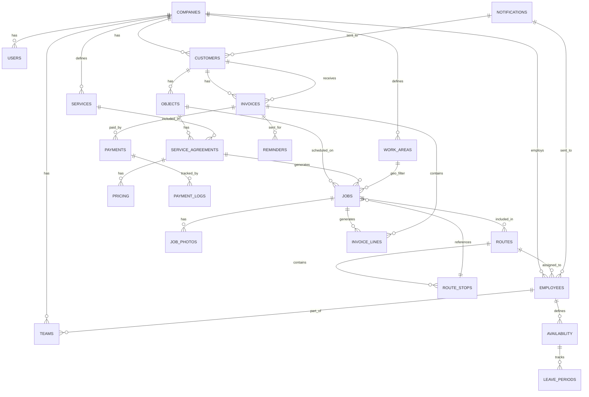

# 11 — Database Concept

**Status:** DONE
**Versie:** 1.0
**Bron van waarheid:** `00_PRD.md` § 12 (Technische Architectuur) — dit document mag het PRD niet tegenspreken.
**Werkinstructie:** zie `MASTER_PROMPT.md`.

---

## Doel van dit document

Dit document bevat het **logische en fysieke database-design** van RouteFlow:
- Architectuur-principes (PostgreSQL, RLS, PostGIS)
- Entity-Relationship Diagram (ERD)
- Tabel-overzicht met constraints
- Indexering & performance-strategie
- Soft-delete/archivering
- Migratie-aanpak

---

## 1. Architectuur-uitgangspunten

### PostgreSQL + Supabase

- **DBMS:** PostgreSQL 15+ (via Supabase)
- **Hosting:** Supabase (EU region, GDPR-compliant)
- **Extensions:** PostGIS (geodata), uuid-ossp (surrogate keys), pgcrypto (hashing)

### Multi-Tenancy via RLS (Row-Level Security)

**Principe:** Elke tabel bevat kolom `company_id` (Foreign Key → `companies` tabel). RLS-policies zorgen dat gebruiker NOOIT data van ander bedrijf ziet, ongeacht query.

**Implementatie:**
```sql
ALTER TABLE customers ENABLE ROW LEVEL SECURITY;

CREATE POLICY "Users see only own company's customers"
  ON customers FOR ALL
  USING (company_id = current_company_id());
```

**Benefit:** Database-level enforcement; geen bugs door query-filtering.

### UTC Timestamps

- Alle timestamps in kolommen `created_at`, `updated_at`, `completed_at` in **UTC**
- Uitmilieu: Europe/Amsterdam (PostgreSQL timezone settings)
- UI render via client-side timezone-conversion

### PostGIS Geodata

- Kolom `location` (geometry, SRID 4326 = WGS84): lat/lng van objecten
- Queries: geografische clustering via `ST_DWithin()`, etc.

---

## 2. Entity-Relationship Diagram (ERD)



---

## 3. Tabellenoverzicht met relaties

### 3.1 Tenant & User Management

#### `companies`
| Kolom | Type | Vereist | Uniek | Opmerkingen |
|---|---|---|---|---|
| `id` | UUID | ✓ | ✓ | PK |
| `name` | VARCHAR(255) | ✓ | ✗ | Bedrijfsnaam |
| `slug` | VARCHAR(100) | ✓ | ✓ | URL-friendly name |
| `created_at` | TIMESTAMP | ✓ | ✗ | UTC |
| `updated_at` | TIMESTAMP | ✓ | ✗ | UTC |
| `subscription_tier` | ENUM(starter,pro,enterprise) | ✓ | ✗ | Facturering |
| `max_employees` | INT | ✓ | ✗ | Soft-limit per tier |
| `config_json` | JSONB | ✓ | ✗ | Settings: BTW-default, verzend-voorkeur, herinner-dagen, etc. |
| `archived_at` | TIMESTAMP | ✗ | ✗ | Null = actief |

**Constraints:**
- PK: `id`
- UNIQUE: `slug`
- CHECK: `max_employees > 0`

---

#### `users`
| Kolom | Type | Vereist | Opmerkingen |
|---|---|---|---|
| `id` | UUID | ✓ | PK, Supabase Auth ID |
| `company_id` | UUID | ✓ | FK → `companies.id` |
| `email` | VARCHAR(255) | ✓ | Unique per company |
| `role` | ENUM(owner, admin, planner, support) | ✓ | Autorisatie |
| `full_name` | VARCHAR(255) | ✓ | Display name |
| `created_at` | TIMESTAMP | ✓ | UTC |
| `updated_at` | TIMESTAMP | ✓ | UTC |
| `last_login_at` | TIMESTAMP | ✗ | Audit |
| `archived_at` | TIMESTAMP | ✗ | Soft-delete |

**Constraints:**
- PK: `id`
- FK: `company_id` → `companies`
- UNIQUE: (`company_id`, `email`)
- RLS: gebruiker ziet only own `company_id`

---

### 3.2 Klanten & Objecten

#### `customers`
| Kolom | Type | Vereist | Opmerkingen |
|---|---|---|---|
| `id` | UUID | ✓ | PK |
| `company_id` | UUID | ✓ | FK, RLS |
| `name` | VARCHAR(255) | ✓ | Klant naam |
| `type` | ENUM(person, business) | ✓ | |
| `email` | VARCHAR(255) | ✗ | |
| `phone` | VARCHAR(20) | ✗ | |
| `whatsapp_number` | VARCHAR(20) | ✗ | |
| `whatsapp_opt_in` | BOOLEAN | ✓ | default FALSE |
| `email_opt_in` | BOOLEAN | ✓ | default TRUE |
| `billing_preference` | ENUM(email, whatsapp, post) | ✓ | default email |
| `kvk_number` | VARCHAR(8) | ✗ | Only if type=business |
| `vat_number` | VARCHAR(14) | ✗ | |
| `payment_terms_days` | INT | ✓ | default 14 |
| `notes` | TEXT | ✗ | |
| `created_at` | TIMESTAMP | ✓ | UTC |
| `updated_at` | TIMESTAMP | ✓ | UTC |
| `archived_at` | TIMESTAMP | ✗ | Soft-delete |

**Constraints:**
- PK: `id`
- FK: `company_id` → `companies`
- UNIQUE: (`company_id`, `email`) WHERE email IS NOT NULL
- RLS: `company_id = current_company_id()`

---

#### `objects` (Werklocatie)
| Kolom | Type | Vereist | Opmerkingen |
|---|---|---|---|
| `id` | UUID | ✓ | PK |
| `company_id` | UUID | ✓ | FK, RLS |
| `customer_id` | UUID | ✓ | FK → `customers` |
| `address_line1` | VARCHAR(255) | ✓ | Postcode + huisnummer |
| `address_line2` | VARCHAR(255) | ✗ | Apt/unit |
| `postal_code` | VARCHAR(10) | ✓ | NL: 4 letters + 2 digits |
| `city` | VARCHAR(100) | ✓ | Plaats |
| `country_code` | VARCHAR(2) | ✓ | default NL |
| `location` | geometry(Point,4326) | ✓ | PostGIS lat/lng |
| `location_status` | ENUM(geocoded, manual, failed) | ✓ | Geocoding status |
| `type` | ENUM(residence, commercial, complex, other) | ✓ | |
| `access_notes` | TEXT | ✗ | "3x bellen", etc. |
| `created_at` | TIMESTAMP | ✓ | UTC |
| `updated_at` | TIMESTAMP | ✓ | UTC |
| `archived_at` | TIMESTAMP | ✗ | Soft-delete |

**Constraints:**
- PK: `id`
- FK: `company_id`, `customer_id`
- UNIQUE: (`company_id`, `customer_id`, `postal_code`, `address_line1`)
- SPATIAL INDEX: `location` (GiST index voor PostGIS queries)
- RLS: `company_id = current_company_id()`

---

### 3.3 Diensten & Afspraken

#### `services`
| Kolom | Type | Vereist | Opmerkingen |
|---|---|---|---|
| `id` | UUID | ✓ | PK |
| `company_id` | UUID | ✓ | FK, RLS |
| `name` | VARCHAR(255) | ✓ | "Glasbewassing buiten" |
| `description` | TEXT | ✗ | |
| `standard_duration_minutes` | INT | ✓ | Geschatte duur |
| `standard_price_cents` | INT | ✓ | In centen (€5.50 = 550) |
| `vat_rate` | DECIMAL(5,2) | ✓ | 0, 9, 21 (als %) |
| `is_weather_sensitive` | BOOLEAN | ✓ | default FALSE |
| `weather_sensitivity_type` | ENUM(rain, frost, wind) | ✗ | If weather_sensitive |
| `icon` | VARCHAR(50) | ✗ | Emoji of icon-name |
| `color_hex` | VARCHAR(7) | ✗ | #RRGGBB |
| `archived_at` | TIMESTAMP | ✗ | Soft-delete |

---

#### `service_agreements`
| Kolom | Type | Vereist | Opmerkingen |
|---|---|---|---|
| `id` | UUID | ✓ | PK |
| `company_id` | UUID | ✓ | FK, RLS |
| `object_id` | UUID | ✓ | FK → `objects` |
| `service_id` | UUID | ✓ | FK → `services` |
| `frequency_type` | ENUM(weekly, biweekly, monthly, quarterly, yearly, once, custom) | ✓ | |
| `frequency_interval` | INT | ✗ | Days (if custom) |
| `pricing_id` | UUID | ✓ | FK → `pricings` |
| `preferred_day` | INT | ✗ | 0=Ma–6=Zo |
| `preferred_daypart` | ENUM(morning, afternoon) | ✗ | |
| `flexibility_window_days` | INT | ✓ | default 3 (±3 werkdagen) |
| `call_ahead_required` | BOOLEAN | ✓ | default FALSE |
| `exclude_dates` | DATE[] | ✗ | Feestdagen, etc. |
| `status` | ENUM(active, paused, ended) | ✓ | default active |
| `paused_until` | DATE | ✗ | If status=paused |
| `ended_at` | TIMESTAMP | ✗ | If status=ended |
| `last_completed_job_id` | UUID | ✗ | FK → `jobs` (optimization) |
| `next_ideal_date` | DATE | ✗ | Cached ideale datum volgende beurt |
| `created_at` | TIMESTAMP | ✓ | UTC |
| `updated_at` | TIMESTAMP | ✓ | UTC |

**Constraints:**
- PK: `id`
- FK: `company_id`, `object_id`, `service_id`, `pricing_id`
- UNIQUE: (`company_id`, `object_id`, `service_id`)

---

### 3.4 Beurten & Routes

#### `jobs`
| Kolom | Type | Vereist | Opmerkingen |
|---|---|---|---|
| `id` | UUID | ✓ | PK |
| `company_id` | UUID | ✓ | FK, RLS |
| `service_agreement_id` | UUID | ✓ | FK |
| `route_id` | UUID | ✗ | FK → `routes` (null als status=proposed) |
| `scheduled_date` | DATE | ✓ | Plannde datum |
| `status` | ENUM (proposed,planned,en_route,completed,not_home,cancelled,rescheduling) | ✓ | BR-050 machine |
| `started_at` | TIMESTAMP | ✗ | Wanneer medewerker started |
| `completed_at` | TIMESTAMP | ✗ | Wanneer medewerker finished |
| `locked` | BOOLEAN | ✓ | default FALSE |
| `locked_until` | DATE | ✗ | Vergrendeld tot datum |
| `locked_reason` | VARCHAR(255) | ✗ | "Klant dinsdag 10:00 verwacht" |
| `notes` | TEXT | ✗ | |
| `estimated_duration_minutes` | INT | ✓ | |
| `actual_duration_minutes` | INT | ✗ | Berekend `completed_at - started_at` |
| `created_at` | TIMESTAMP | ✓ | UTC |
| `updated_at` | TIMESTAMP | ✓ | UTC |

**Constraints:**
- PK: `id`
- FK: `company_id`, `service_agreement_id`, `route_id`
- INDEX: (`company_id`, `scheduled_date`) voor planning-queries
- INDEX: (`company_id`, `status`) voor status-filtering

---

#### `routes`
| Kolom | Type | Vereist | Opmerkingen |
|---|---|---|---|
| `id` | UUID | ✓ | PK |
| `company_id` | UUID | ✓ | FK, RLS |
| `employee_id` | UUID | ✓ | FK → `employees` |
| `route_date` | DATE | ✓ | |
| `total_distance_meters` | INT | ✗ | |
| `total_drive_time_minutes` | INT | ✗ | |
| `total_work_time_minutes` | INT | ✗ | Som estimated_duration van jobs |
| `sequence_version` | INT | ✓ | default 0; increment bij re-optim |
| `optimization_score` | DECIMAL(5,2) | ✗ | 0–100 (reistijd/frequentie balance) |
| `created_at` | TIMESTAMP | ✓ | UTC |
| `updated_at` | TIMESTAMP | ✓ | UTC |

**Constraints:**
- PK: `id`
- FK: `company_id`, `employee_id`
- UNIQUE: (`company_id`, `employee_id`, `route_date`)

---

### 3.5 Medewerkers & Beschikbaarheid

#### `employees`
| Kolom | Type | Vereist | Opmerkingen |
|---|---|---|---|
| `id` | UUID | ✓ | PK |
| `company_id` | UUID | ✓ | FK, RLS |
| `user_id` | UUID | ✗ | FK → `users` (if app-user) |
| `first_name` | VARCHAR(100) | ✓ | |
| `last_name` | VARCHAR(100) | ✓ | |
| `phone` | VARCHAR(20) | ✓ | Contact |
| `is_active` | BOOLEAN | ✓ | default TRUE |
| `created_at` | TIMESTAMP | ✓ | UTC |
| `updated_at` | TIMESTAMP | ✓ | UTC |
| `archived_at` | TIMESTAMP | ✗ | Soft-delete |

---

#### `availability`
| Kolom | Type | Vereist | Opmerkingen |
|---|---|---|---|
| `id` | UUID | ✓ | PK |
| `company_id` | UUID | ✓ | FK |
| `employee_id` | UUID | ✓ | FK |
| `date` | DATE | ✓ | |
| `status` | ENUM(available, sick, leave) | ✓ | |
| `reason` | VARCHAR(255) | ✗ | "Griep", "Jaarlijks verlof" |
| `created_at` | TIMESTAMP | ✓ | UTC |

**Constraints:**
- PK: `id`
- UNIQUE: (`company_id`, `employee_id`, `date`)

---

### 3.6 Facturatie

#### `invoices`
| Kolom | Type | Vereist | Opmerkingen |
|---|---|---|---|
| `id` | UUID | ✓ | PK |
| `company_id` | UUID | ✓ | FK, RLS |
| `customer_id` | UUID | ✓ | FK |
| `invoice_number` | VARCHAR(50) | ✗ | Format: ABC-2026-00001 (null = draft) |
| `status` | ENUM(draft, finalized, sent, overdue, cancelled) | ✓ | default draft |
| `invoice_date` | DATE | ✓ | |
| `due_date` | DATE | ✓ | invoice_date + payment_terms_days |
| `total_amount_cents` | INT | ✓ | Incl. BTW |
| `total_tax_cents` | INT | ✓ | |
| `currency` | VARCHAR(3) | ✓ | EUR |
| `payment_status` | ENUM(open, paid, partial, overdue) | ✓ | default open |
| `payment_id` | VARCHAR(255) | ✗ | Mollie payment ID |
| `notes` | TEXT | ✗ | |
| `created_at` | TIMESTAMP | ✓ | UTC |
| `updated_at` | TIMESTAMP | ✓ | UTC |
| `sent_at` | TIMESTAMP | ✗ | Verzending-moment |

**Constraints:**
- PK: `id`
- FK: `company_id`, `customer_id`
- UNIQUE: (`company_id`, `invoice_number`) WHERE invoice_number IS NOT NULL
- INDEX: (`company_id`, `status`, `due_date`)

---

#### `invoice_lines`
| Kolom | Type | Vereist | Opmerkingen |
|---|---|---|---|
| `id` | UUID | ✓ | PK |
| `invoice_id` | UUID | ✓ | FK |
| `job_id` | UUID | ✗ | FK → `jobs` (null = manual line) |
| `service_id` | UUID | ✗ | FK → `services` (for reference) |
| `description` | VARCHAR(255) | ✓ | "Glasbewassing (14/7/2026)" |
| `quantity` | DECIMAL(10,2) | ✓ | default 1.0 |
| `unit_price_cents` | INT | ✓ | Exclusief BTW |
| `vat_rate` | DECIMAL(5,2) | ✓ | 0, 9, 21 (%) |
| `vat_amount_cents` | INT | ✓ | Calculated |
| `total_amount_cents` | INT | ✓ | unit_price × qty + vat |
| `sequence` | INT | ✓ | Sorteer-volgorde |

**Constraints:**
- PK: `id`
- FK: `invoice_id`, `job_id`, `service_id`

---

#### `payments`
| Kolom | Type | Vereist | Opmerkingen |
|---|---|---|---|
| `id` | UUID | ✓ | PK |
| `invoice_id` | UUID | ✓ | FK |
| `payment_method` | ENUM(ideal, sepa, manual) | ✓ | |
| `amount_cents` | INT | ✓ | |
| `payment_date` | DATE | ✓ | |
| `mollie_payment_id` | VARCHAR(255) | ✗ | Reference to Mollie |
| `status` | ENUM(pending, completed, failed, refunded) | ✓ | |
| `webhook_verified` | BOOLEAN | ✓ | Mollie-webhook received |
| `notes` | TEXT | ✗ | |
| `created_at` | TIMESTAMP | ✓ | UTC |

**Constraints:**
- PK: `id`
- FK: `invoice_id`

---

### 3.7 Communicatie

#### `notifications`
| Kolom | Type | Vereist | Opmerkingen |
|---|---|---|---|
| `id` | UUID | ✓ | PK |
| `company_id` | UUID | ✓ | FK, RLS |
| `recipient_type` | ENUM(customer, employee) | ✓ | |
| `recipient_id` | UUID | ✓ | FK → customers OR employees |
| `notification_type` | ENUM(appointment_reminder, not_home_alert, invoice_sent, payment_received, reschedule_alert) | ✓ | |
| `channel` | ENUM(email, whatsapp, in_app) | ✓ | |
| `subject` | VARCHAR(255) | ✗ | E-mail subject |
| `message` | TEXT | ✓ | Body |
| `template_id` | UUID | ✗ | FK → `notification_templates` |
| `reference_job_id` | UUID | ✗ | Context |
| `reference_invoice_id` | UUID | ✗ | Context |
| `status` | ENUM(pending, sent, failed, delivered) | ✓ | default pending |
| `sent_at` | TIMESTAMP | ✗ | |
| `read_at` | TIMESTAMP | ✗ | In-app only |
| `error_message` | TEXT | ✗ | If failed |
| `created_at` | TIMESTAMP | ✓ | UTC |

**Constraints:**
- PK: `id`
- FK: `company_id`

---

## 4. Indexering-strategie

### Performance-kritieke queries

1. **Planning per dag:** `SELECT * FROM jobs WHERE company_id=? AND scheduled_date=? ORDER BY sequence`
   - **Index:** `(company_id, scheduled_date, sequence)`

2. **Geografische clustering:** `SELECT * FROM objects WHERE company_id=? AND ST_DWithin(location, $point, $distance_m)`
   - **Index:** SPATIAL GiST op `location`

3. **Open facturen:** `SELECT * FROM invoices WHERE company_id=? AND payment_status='open' AND due_date < NOW()`
   - **Index:** `(company_id, payment_status, due_date)`

4. **Route-optimalisatie:** `SELECT * FROM jobs WHERE company_id=? AND route_id IS NULL AND scheduled_date BETWEEN ? AND ? ORDER BY scheduled_date`
   - **Index:** `(company_id, route_id, scheduled_date)`

5. **Beschikbaarheid-check:** `SELECT * FROM availability WHERE company_id=? AND employee_id=? AND date=?`
   - **Index:** UNIQUE `(company_id, employee_id, date)`

### Index-creatie-statements

```sql
CREATE INDEX idx_jobs_company_date ON jobs(company_id, scheduled_date);
CREATE INDEX idx_jobs_company_route ON jobs(company_id, route_id, scheduled_date);
CREATE INDEX idx_invoices_company_status ON invoices(company_id, payment_status, due_date);
CREATE INDEX idx_objects_location ON objects USING GIST(location);
CREATE INDEX idx_availability_emp_date ON availability(company_id, employee_id, date);
CREATE INDEX idx_notifications_recipient ON notifications(recipient_type, recipient_id);
```

---

## 5. Soft-Delete & Archivering-beleid

### Soft-Delete Pattern

Tabellen met `archived_at`-kolom gebruiken soft-delete (niet werkelijk verwijderd):
- `customers`, `objects`, `services`, `users`, `employees`

**Query-conventie:** WHERE queries filteren automatisch `archived_at IS NULL`
**View-wrapper (optioneel):** CREATE VIEW `customers_active` AS SELECT * FROM customers WHERE archived_at IS NULL

**Voordelen:**
- Audit-trail behouden
- Historische rapportage
- AVG-compliance (niet onherstelbaar verwijderd)

### Hard-Delete (immutable records)

Bepaalde tabellen mag NOOIT soft-delete (audit-trail):
- `payments`, `invoice_lines`, `notification_logs`

---

## 6. Migratiestrategie

### Schema-versioning

Migraties opgeslagen in `/migrations` directory, genummerd:
- `001_initial_schema.sql`
- `002_add_rls_policies.sql`
- `003_add_spatial_index.sql`

### Deployment-proces

1. Lokale test: `supabase db push` (migratie-scripts draaien)
2. Preview-env: automated migratie via Vercel preview-deploy
3. Prod: manual approval + `supabase db push --linked`

### Rollback-strategie

Supabase Point-in-Time Recovery (PITR); max 30 dagen backwards.

---

## 7. Audit Trail & Logging

### Audit-tabel (optioneel, V2)

```sql
CREATE TABLE audit_log (
  id UUID PRIMARY KEY,
  company_id UUID NOT NULL,
  table_name VARCHAR(100),
  record_id UUID,
  action ENUM('INSERT', 'UPDATE', 'DELETE'),
  old_values JSONB,
  new_values JSONB,
  changed_by UUID,
  changed_at TIMESTAMP DEFAULT NOW()
);
```

**Triggers:** per kritieke tabel (customers, jobs, invoices, payments) — log wijzigingen.

### Activity-log (MVP: in notifications-tabel)

`notifications` tabel slaat operaties op; UI toont "Tijdlijn" per klant (FR-007).

---

## Relaties met andere documenten

- **12_Entiteiten.md**: NL ↔ EN mapping per entity
- **08_FunctioneleEisen.md**: queries ondersteunen deze features
- **10_BusinessRules.md**: constraints afdwingend via DDL
- **36_Security.md**: RLS-policies per role

---

## Changelog

| Datum | Versie | Wijziging |
|---|---|---|
| 2026-07-06 | 1.0 | Volledig uitgewerkt: ERD (Mermaid), alle 17 tabellen, constraints, RLS-strategie, indexering, soft-delete, migratie-aanpak |
