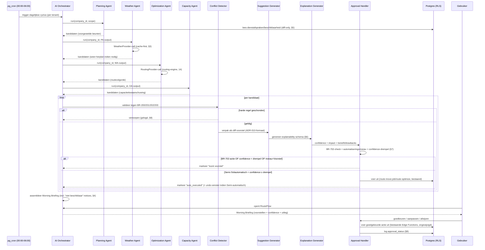

# ADR-012: AI Execution Pipeline — runtime-samenwerking tussen agents

- **Status:** Accepted
- **Datum:** 2026-07-12
- **Beslisser:** Chief Software Architect (RouteFlow)
- **Bron van waarheid:** `docs/adr/ADR-011-human-in-the-loop-ai.md` (waarom/architectuurbeslissing) en `43_AI_Agents.md` (welke agents, per-agent verantwoordelijkheid) — dit ADR spreekt geen van beide tegen, het specificeert de **technische runtime-mechaniek**: hoe de acht agents daadwerkelijk uitvoeren, in welke volgorde, binnen welke tijds-/kostenbudgetten, en met welk gegarandeerd outputcontract.
- **Gerelateerd:** ADR-007 (Provider Adapter Pattern), ADR-008 (Edge Functions), ADR-010 (AI Planner drielagen-architectuur, diff-model), ADR-011 (Human-in-the-Loop AI, Agent-orchestratie); `15_AIPlanner.md`, `43_AI_Agents.md`, `10_BusinessRules.md` (BR-700–703, BR-200–205), `41_CodingStandards.md` § 11 (logging), `14_RoutingEngine.md` (Optimization Agent-fundament)

---

## Context

ADR-011 legt vast **dat** RouteFlow uit acht samenwerkende AI Agents bestaat, gecoördineerd door een Agent Orchestrator, resulterend in een dagelijkse Morning Briefing (FR-900) met een harde Human-Approval-grens (BR-702) en een verplicht confidence/explainability-outputcontract (BR-703). `43_AI_Agents.md` legt vast **wat** elke agent doet (verantwoordelijkheid, input, output, business rules, triggers).

Geen van beide documenten specificeert **hoe** dit technisch samenkomt tijdens runtime: in welke volgorde agents daadwerkelijk uitvoeren (en welke parallel kunnen), hoe een individuele agent-aanroep zich technisch gedraagt (timeout, retry, cache), hoe een gefaalde of misvormde agent-output wordt afgehandeld zonder de rest van de keten te breken, hoe AI-kosten (calls/tokens) begrensd blijven bij honderden tenants, en hoe het BR-703-outputcontract *uniform* wordt afgedwongen ongeacht welke agent de output produceert — in plaats van dat elke agent zijn eigen explainability-logica herimplementeert.

## Probleem

Hoe voeren we acht domeingespecialiseerde agents (met onderlinge datadependencies: Optimization Agent heeft Planning Agent's toewijzing nodig, Capacity Agent heeft Optimization Agent's werktijd-uitkomst nodig) betrouwbaar uit binnen de bestaande Edge-Function-architectuur (ADR-008), zodat (a) onafhankelijke agents parallel kunnen draaien voor snelheid, (b) een falende agent nooit de hele Morning Briefing blokkeert, (c) AI-kosten begrensd en voorspelbaar blijven, (d) elke voorgestelde wijziging — ongeacht welke agent hem produceerde — hetzelfde confidence/explanation/approval-contract doorloopt, en (e) dit alles zonder een nieuw "agent framework" of aparte runtime te introduceren?

## Gekozen oplossing

Een **centrale AI Orchestrator** (één Edge Function, geen nieuwe infrastructuur — ADR-008) voert de acht agents (ADR-011 § 2, `43_AI_Agents.md`) uit volgens een vaste dependency graph, en elke **kandidaat-wijziging** die een agent wil voorstellen doorloopt daarna een gedeelde **Execution Pipeline** van acht stappen — dit is een cross-cutting laag (vergelijkbaar met hoe ADR-007 provider-adapters cross-cutting factorde) die het BR-703-contract eenmalig, uniform afdwingt in plaats van dat elke agent zijn eigen explainability/approval-logica bouwt.

**Belangrijk onderscheid** (voorkomt verwarring met `43_AI_Agents.md`'s acht agents): de acht **agents** (Planning, Replanning, Weather, Communication, Invoice, Capacity, Revenue, Optimization) bepalen **wie** analyseert en **wat** hij voorstelt (domeinlogica). De acht **pipeline-stadia** hieronder (§ 2) bepalen **hoe** elke individuele kandidaat-wijziging — ongeacht welke agent hem produceerde — verwerkt, gevalideerd, uitgelegd en goedgekeurd wordt (technisch contract). Eén agent-run kan meerdere kandidaten genereren; elke kandidaat doorloopt de volledige pipeline afzonderlijk.

### 1. Orchestration

**Eén centrale AI Orchestrator:** een enkele Edge Function (bijv. `agent-orchestrator`, exacte naam is implementatiedetail voor de bouwende sprint) die zelf geen domeinlogica bevat — uitsluitend volgorde, dependency-resolutie, en foutisolatie tussen agents (ADR-011 § 3, ongewijzigd, hier technisch uitgewerkt).

**Agent-volgorde & dependency graph:**

```
Planning Agent ──┬──► Weather Agent ──► Optimization Agent ──► Capacity Agent ──┬──► Communication Agent
                  │                                                              │
                  └──────────────────────────────────────────────────────────────┘
                                                                                   │
Revenue Agent ◄────────────────────────────────────────────────────────────────┤ (leest voltooide/geplande
Invoice Agent ◄────────────────────────────────────────────────────────────────┘  beurten, geen afhankelijkheid
                                                                                    van de planningsketen hierboven)
```

- **Harde dependency-keten** (sequentieel, elke stap heeft de vorige nodig): Planning Agent → Weather Agent (moet weten welke beurten die week gepland zijn) → Optimization Agent (moet weten welke beurten, evt. na weer-herplanning, definitief die dag staan) → Capacity Agent (moet de daadwerkelijke werktijd per medewerker kennen, ADR-011's bestaande volgorde bevestigd en hier vastgelegd als technische dependency, niet alleen procesvolgorde).
- **Parallel uitvoerbaar** (geen onderlinge datadependency): Revenue Agent en Invoice Agent lezen uitsluitend voltooide/geplande beurten en prijsafspraken — geen afhankelijkheid van de Planning/Weather/Optimization/Capacity-keten, draaien gelijktijdig ermee. Communication Agent start zodra Capacity Agent klaar is (heeft de definitieve dagindeling nodig voor correcte "morgen"-berichten) maar hoeft niet te wachten op Revenue/Invoice Agent.
- **Replanning Agent** valt buiten dit dagelijkse schema (ADR-011 § 6: event-driven, niet cyclus-gebonden) — wordt gestart door een user-actie of een Weather/Capacity Agent-trigger (bv. een capaciteitstekort dat een herplanvoorstel rechtvaardigt), draait als eigen, geïsoleerde pipeline-doorloop.
- **Event flow:** ongewijzigd t.o.v. ADR-011 § 6 (00:00–06:00-venster); dit ADR voegt toe dat de Orchestrator per agent-stap een `agent_run`-event publiceert (start/eind/resultaat) waarop zowel de volgende agent in de keten als het logging-mechanisme (§ 8) luisteren — geen nieuwe message queue, dit is een rij in een bestaande tabel (analoog aan hoe `route-optimize` zijn eigen voortgang logt, geen pub/sub-infrastructuur).

### 2. Execution Pipeline

Elke kandidaat-wijziging die een agent wil voorstellen doorloopt, ná generatie door de betrokken agent, deze gedeelde stadia:

```
Morning Briefing (assemblage-stap, Orchestrator — geen agent zelf)
        ↓ triggert de agent-keten (§ 1)
Planning Analyzer        — Planning Agent's horizon-/dag-laag-analyse (15_AIPlanner.md § 1.1/1.2)
        ↓
Conflict Detector        — gedeelde validatiestap (niet één agent): toetst elke kandidaat tegen
                            BR-200/201/202/203 (harde regels) vóórdat hij verder mag; een kandidaat
                            die een harde regel schendt wordt hier al verworpen, nooit later
        ↓
Travel Optimizer          — Optimization Agent (14_RoutingEngine.md, routing-engine — ongewijzigd)
        ↓
Capacity Optimizer        — Capacity Agent (43_AI_Agents.md § 9)
        ↓
Suggestion Generator      — verpakt de kandidaat tot een diff-voorstel in het bestaande ADR-010-formaat
                            (15_AIPlanner.md § 7.2: beurt · van → naar · extra reistijd/impact)
        ↓
Explanation Generator     — vult het BR-703-outputcontract (§ 6 hieronder): reasoning, confidence,
                            impacted jobs/employees, expected benefit, mogelijke nadelen
        ↓
Approval Handler          — bepaalt exact (§ 7): automatisch uitvoeren, voorstel tonen, of verplichte
                            goedkeuring — nooit een uitzondering op BR-702
```

De **Conflict Detector** is bewust géén negende agent maar een gedeelde, domeinneutrale validatiestap — dezelfde harde-regel-toetsing (BR-200/201/202/203) die vandaag al verspreid in `route-optimize`/`route-move-job` zit (14_RoutingEngine.md), hier expliciet als herbruikbare pipeline-stap benoemd zodat elke agent (niet alleen Optimization Agent) er doorheen moet vóór een kandidaat de gebruiker bereikt.

### 3. Agent Contract

Elke agent-aanroep (ongeacht welke van de acht) volgt hetzelfde technische contract:

| Aspect | Specificatie |
|---|---|
| **Input** | Vaste envelope: `{ company_id, scope (bv. datum/periode), upstream_outputs (afhankelijke agent-resultaten uit § 1) }` — nooit rechtstreeks ruwe tabeldata zonder tenant-scoping (RLS blijft de harde grens, ADR-003/004) |
| **Output** | Lijst van kandidaten, elk met het volledige § 6-explainability-schema; lege lijst is een geldig, geen foutief resultaat ("niets te melden") |
| **Confidence score** | **0–1** (float) op technisch/pipeline-niveau — dit is de interne representatie die de Explanation Generator en Approval Handler gebruiken voor drempelvergelijkingen (§ 7). De UI-laag (`43_AI_Agents.md` § 13, `10_BusinessRules.md` BR-703, bestaande `WhyExplanation`-component) toont dit als 0–100 voor leesbaarheid (`score × 100`) — een weergaveconventie, geen tweede, afwijkende bron van waarheid. |
| **Explanation** | Zie § 6 — verplicht, geen optioneel veld |
| **Execution timeout** | Analytische agents zonder externe provider-call (Capacity, Revenue): 10s. Agents met provider-call (Weather via `WeatherProvider`, Optimization via `RoutingProvider`): 30s, consistent met de bestaande performancebudgetten voor routing (NFR-103, 14_RoutingEngine.md § 7: <3s per 60 stops per aanroep — 30s dekt een volledige dagbatch over meerdere medewerkers). Communication/Invoice Agent (conceptgeneratie, geen finale verzending): 15s. |
| **Retry policy** | Eén retry bij een transiënte fout (timeout, provider 5xx/netwerkfout) met korte backoff; **geen retry** bij een validatie-/schemafout (malformed input/output, § 4) — die faalt deterministisch opnieuw en verspilt alleen budget (§ 5). Na de retry: stap overgeslagen, gelogd (§ 8), keten gaat door (§ 4). |
| **Cache policy** | Agents met een externe provider-call hergebruiken de bestaande per-domein-cache (`distance_cache`, weerdata-cache — 11_DatabaseConcept.md § 3.8/3.9-precedent); geen agent bouwt een eigen, parallelle cache-laag. Analytische agents zonder provider-call cachen niet apart (normale querysnelheid volstaat, 41_CodingStandards.md § 17). |

### 4. Failure Handling

- **Provider timeout:** afgehandeld door § 3's timeout+retry; na uitputting van de retry wordt de stap overgeslagen met een gelogde waarschuwing (§ 8) — identiek aan het al-bestaande AP-04-patroon (`15_AIPlanner.md` § 11: weer-API onbereikbaar → weerslaag inactief, planning gaat door).
- **Malformed output:** elke agent-output wordt tegen een Zod-schema gevalideerd (41_CodingStandards.md § 2, "runtime-validatie op elke grens") vóórdat hij de Conflict Detector bereikt — een kandidaat die niet aan het schema voldoet wordt verworpen en gelogd, **nooit** doorgezet in een "best effort"-vorm (geen halve/gegokte voorstellen naar de gebruiker).
- **Partial failures:** agents zijn onderling geïsoleerd (§ 1: geen agent roept een andere rechtstreeks aan) — het falen van bijvoorbeeld Weather Agent blokkeert Revenue/Invoice Agent niet, en blokkeert ook niet de rest van de planningsketen (Optimization Agent draait door zonder weer-herplanning, zoals vandaag al AP-04). De Morning Briefing-assemblage toont expliciet welke analyses ontbraken ("Weersanalyse tijdelijk niet beschikbaar") in plaats van te doen alsof de Briefing compleet is — consistent met 24_UI_UX.md's regel tegen misleidende lege/foutieve staten.
- **Fallback zonder AI:** de kernplanningsalgoritmes (horizon-/dag-laag, routing-engine) zijn **deterministische heuristieken**, geen LLM (ADR-010 wees "black-box ML" al expliciet af) — deze hebben dus per definitie geen "AI-fallback" nodig, ze zíjn de fallback. Waar een toekomstige agent-stap wél een taalmodel zou gebruiken (bijv. natuurlijke-taal-formulering van de Explanation Generator's `reasoning`-veld, of Communication Agent's berichttekst), is de fallback het **bestaande, deterministische BR-700-reden-object** (15_AIPlanner.md § 9) via een simpel template gerenderd — nooit een blokkerende afhankelijkheid van een taalmodel voor kernfunctionaliteit.
- **Graceful degradation (drie niveaus):**
  1. **Volledig:** alle agents + eventuele taalmodel-verrijking (formulering) werken.
  2. **Verminderd:** taalmodel-stappen falen/timeout → deterministische templates i.p.v. verrijkte formulering; kernvoorstellen (Planning/Optimization/Capacity) blijven ongewijzigd werken, want die zijn nooit taalmodel-afhankelijk geweest.
  3. **Uitgeschakeld:** een kernagent zelf faalt structureel (bv. Optimization Agent kan de routing-provider niet bereiken) → Morning Briefing toont een duidelijke melding + directe link naar het bestaande, volledig handmatige planningsscherm (`/planning`, Sprint 4 Frontend) — de applicatie blijft altijd bruikbaar zonder AI, want handmatige planning was er al vóór de agent-architectuur en wordt door geen enkele agent vervangen, alleen aangevuld.

### 5. Cost Management

- **Maximaal aantal AI-calls per planning:** een bedrijf-instelbaar dagbudget (default-waarde vast te stellen door de bouwende sprint) begrenst het totaal aantal provider-calls (Weather/Optimization/eventuele taalmodel-calls) per Morning-Briefing-cyclus; bij overschrijding: laagste-prioriteit-kandidaten (§ 1, prioritering ADR-011 § 3) worden niet verder verwerkt, gelogd als "budget bereikt", nooit stil afgekapt zonder melding.
- **Token budget:** per taalmodel-aanroep (indien van toepassing, § 4) een vast token-plafond; een kandidaat-batch die dat zou overschrijden wordt gesplitst (§ batching hieronder) in plaats van afgekapt tot onbegrijpelijke output.
- **Batching:** de Explanation Generator en Communication Agent verwerken kandidaten in batches (meerdere kandidaten per provider-aanroep waar de provider dat ondersteunt) in plaats van één aanroep per individuele beurt — vermindert overhead evenredig met het aantal beurten per dag.
- **Caching:** zie § 3 — geen agent-specifieke cache-laag, hergebruik van bestaande per-domein-caches. Aanvullend: een kandidaat-uitleg (Explanation Generator-output) wordt **niet opnieuw gegenereerd** als de onderliggende kandidaat ongewijzigd is t.o.v. de vorige cyclus (diff-only, zie hieronder).
- **Diff-only verwerking:** de Orchestrator verwerkt per cyclus uitsluitend **gewijzigde** input sinds de vorige run (nieuwe/gewijzigde dienstafspraken, gewijzigde beschikbaarheid, nieuwe weerdata) — geen agent herberekent dagelijks de volledige dataset vanaf nul. Dit is dezelfde diff-filosofie als ADR-010's reactieve laag (nooit een volledige herplanning, altijd incrementeel), hier toegepast op kostenbeheersing i.p.v. alleen UX-stabiliteit.
- **Voorkomen van dubbele analyses:** elke agent-run draagt een `run_id` + datum; de Orchestrator controleert vóór het (opnieuw) aanroepen van een agent of er al een niet-verlopen, ongeconsumeerd resultaat voor die combinatie bestaat (idempotentie) — voorkomt dubbele kandidaat-generatie bij een overlappende cron-trigger of een retry na een gedeeltelijke Orchestrator-fout.

### 6. Explainability

Elke kandidaat die de Explanation Generator verlaat bevat, als **operationalisatie van BR-703** (dat de eis op businessregelniveau vastlegt; dit ADR pint het exacte schema):

| Veld | Inhoud |
|---|---|
| `reasoning` | Mens-leesbare toelichting (bestaand BR-700-mechanisme, `WhyExplanation`) |
| `confidence` | 0–1 (§ 3) |
| `impacted_jobs` | Expliciete lijst van beurt-ID's die deze kandidaat raakt |
| `impacted_employees` | Expliciete lijst van medewerker-ID's wier planning verandert |
| `expected_benefit` | Kwantitatief waar mogelijk (bv. "-12 min reistijd", "+1 beurt binnen flexvenster") |
| `possible_drawbacks` | Expliciet benoemd, nooit verzwegen — bv. "verstoort een reeds bevestigde beurt van medewerker X" (koppelt aan het bestaande stabiliteitsgewicht, 15_AIPlanner.md § 7.3) |

`impacted_jobs`/`impacted_employees`/`expected_benefit`/`possible_drawbacks` zijn nieuw t.o.v. het bestaande BR-700/703-veldenset (die "bronnen"/"regels"/"alternatieven" al dekte) — een uitbreiding van hetzelfde principe, geen tegenspraak; BR-703 blijft de businessregel-verankering, dit ADR is waar het schema stabiel gepind wordt.

### 7. Human Approval

Exacte beslisregel per kandidaat, uitgevoerd door de Approval Handler:

```
1. Staat de actie op de BR-702-lijst (facturen versturen, betalingen, prijsafspraken wijzigen,
   klant/medewerker verwijderen, definitieve planning overschrijven)?
   → JA: altijd "verplichte goedkeuring" — geen enkele instelling of confidence-waarde overrulet dit.
   → NEE: ga naar stap 2.

2. Wat is het geconfigureerde automatiseringsniveau (15_AIPlanner.md § 8) voor dit agent/actietype?
   - "Voorstel" (default) → toon als voorstel, wacht op expliciete keuze.
   - "Semi-automatisch" → ga naar stap 3.
   - "Volautomatisch" (alleen expliciete opt-in, nooit voor BR-702-acties sowieso al uitgesloten) → ga naar stap 3.

3. Is confidence ≥ de geconfigureerde drempel (default 0.7, bedrijf-instelbaar)?
   → JA: automatisch uitvoeren (Semi-automatisch: met ongedaan-maken-venster + notificatie;
          Volautomatisch: stil uitvoeren + loggen, § 8).
   → NEE: **downgrade naar "toon als voorstel"**, ongeacht het geconfigureerde niveau — een
          lage-confidence-actie automatisch laten lopen is een risico dat geen bedrijfsinstelling
          zou moeten kunnen wegconfigureren.
```

Dit is consistent met en verscherpt ADR-011 § 4 (de zes BR-702-acties blijven absoluut) en voegt de confidence-drempel toe als extra, niet-overrulebare veiligheidslaag boven op het bestaande automatiseringsniveau-model.

### 8. Logging

Elke pipeline-doorloop (per kandidaat, niet alleen per agent-run) wordt gelogd conform het bestaande `41_CodingStandards.md` § 11-beleid (correlatie-id door de hele keten, nooit PII):

| Veld | Inhoud |
|---|---|
| `agent` | Welke van de acht agents de kandidaat produceerde |
| `duration_ms` | Uitvoeringsduur van de agent-stap |
| `model` | Provider/model gebruikt (bv. `mapbox-matrix`, `openmeteo`, of `none` voor zuiver deterministische stappen) |
| `tokens` | Indien van toepassing (taalmodel-stappen); `null` voor deterministische stappen |
| `confidence` | 0–1 (§ 3) |
| `result` | `success` / `failed` / `partial`, + aantal gegenereerde kandidaten |
| `approval_status` | `auto_executed` / `proposed` / `approved` / `rejected` / `expired` |

Dit is de technische, query-bare tegenhanger van `43_AI_Agents.md` § 14's audittrail-eis — geen nieuw logging-mechanisme, een gepind schema bovenop het bestaande.

### 9. Sequence Diagram



## Alternatieven

| Alternatief | Waarom niet |
|---|---|
| **Elke agent implementeert zijn eigen explainability/approval-logica** | Herhaling van BR-700/702/703-logica in acht codebases i.p.v. één gedeelde pipeline; hoog risico op drift (agent X vergeet de confidence-drempel te checken) |
| **Alle agents strikt sequentieel, geen parallellisatie** | Onnodig traag (Revenue/Invoice Agent hebben geen dependency op de planningsketen) zonder enig betrouwbaarheidsvoordeel — parallellisatie waar veilig is een zuivere performancewinst |
| **Eén taalmodel dat de hele pipeline "in één prompt" afhandelt** | Herintroduceert exact het black-box-risico dat ADR-010 al afwees; geen per-stap-controleerbaarheid, geen gedeeltelijke degradatie mogelijk bij falen van één stap |
| **Aparte message queue (bv. SQS) voor agent-naar-agent-communicatie** | Nieuwe infrastructuur, expliciet uitgesloten door de opdracht van dit ADR en door ADR-008's "één samenhangend backend-platform"-keuze |

## Consequenties

**Positief**
- Eén plek (de pipeline, § 2) garandeert dat BR-703's contract nooit per ongeluk overgeslagen wordt door een individuele agent-implementatie.
- Parallellisatie waar veilig (§ 1) houdt de dagelijkse cyclus binnen het 00:00–06:00-venster ook bij groei in tenant-aantal.
- Cost management (§ 5) maakt AI-kosten voorspelbaar en begrensd per bedrijf, voorkomt een "runaway"-scenario bij een bug in een agent.
- Graceful degradation (§ 4) garandeert dat RouteFlow nooit onbruikbaar wordt door een AI-storing — het handmatige pad (Sprint 4 Planning-UI) blijft altijd het vangnet.
- De confidence-drempel als niet-overrulebare veiligheidslaag (§ 7) is een concrete verscherping van ADR-011's Human Approval-principe, niet alleen een configuratie-optie.

**Negatief / risico's**
- De Conflict Detector als gedeelde stap is een nieuw single point of coördinatie tussen agents — een bug daar raakt alle acht agents tegelijk (mitigatie: het is dezelfde harde-regel-logica die vandaag al in `route-optimize`/`route-move-job` bewezen werkt, geen nieuwe logica, alleen een nieuwe gedeelde locatie).
- Diff-only verwerking (§ 5) voegt statusbeheer toe (wat is er sinds de vorige run gewijzigd) dat zorgvuldig getest moet worden om geen wijzigingen te missen.
- Drie degradatieniveaus (§ 4) zijn meer testscenario's dan een simpel "werkt/werkt niet"-model.

**Mitigaties**
- Conflict Detector hergebruikt bewezen, bestaande BR-200/201/202/203-logica (geen nieuwe regel-implementatie, alleen herpositionering).
- Diff-only-statusbeheer volgt hetzelfde `updated_at`/`sequence_version`-patroon dat `routes`/`jobs` al gebruiken (011_service_agreements_indexes.sql-precedent) — geen nieuw trackingmechanisme.
- Degradatieniveaus worden expliciet getest per niveau (31_Testplan.md-uitbreiding, werk voor de bouwende sprint), niet impliciet verondersteld te werken.

## Waarom deze keuze toekomstbestendig is

Door de Execution Pipeline (§ 2) los te koppelen van de acht agents (§ 1) — pipeline-stadia zijn generiek en domeinneutraal, agents zijn domeinspecifiek — kan een toekomstige negende agent (`43_AI_Agents.md` § 15: Voice, Sales, CRM, Inventory, Maintenance, Forecast) zonder wijziging aan de pipeline zelf worden toegevoegd: hij levert kandidaten aan, en de Conflict Detector/Suggestion Generator/Explanation Generator/Approval Handler werken automatisch identiek. Het cost-management-model (§ 5) en de graceful-degradation-niveaus (§ 4) zijn eveneens agent-onafhankelijk, dus schalen mee zonder per-agent-aanpassing. Doordat geen enkel onderdeel een nieuwe infrastructuurlaag introduceert (alles blijft Edge Functions + bestaande Postgres-tabellen + het bestaande Provider Pattern), blijft een toekomstige exit-strategie (bv. zware AI-workloads verplaatsen naar een dedicated workerproces, zoals ADR-008 al voorzag) mogelijk zonder dit ADR te hoeven herzien — alleen de fysieke locatie van de uitvoering verandert, niet het contract.

## Referenties

- `docs/adr/ADR-011-human-in-the-loop-ai.md` (architectuurbeslissing, waarom acht agents + Morning Briefing)
- `43_AI_Agents.md` (per-agent verantwoordelijkheid, input/output/triggers)
- `docs/adr/ADR-010-ai-planner-architecture.md` (diff-model, drielagen-fundament onder Planning/Optimization/Replanning Agent)
- `docs/adr/ADR-007-provider-adapter-pattern.md`, `docs/adr/ADR-008-edge-functions.md` (technische fundamenten, ongewijzigd hergebruikt)
- `10_BusinessRules.md` BR-200–205 (Conflict Detector), BR-700–703 (Explainability/Approval)
- `14_RoutingEngine.md` (Optimization Agent/Travel Optimizer-fundament, performancebudgetten NFR-103)
- `41_CodingStandards.md` § 2 (runtime-validatie), § 11 (logging), § 17 (performance)
